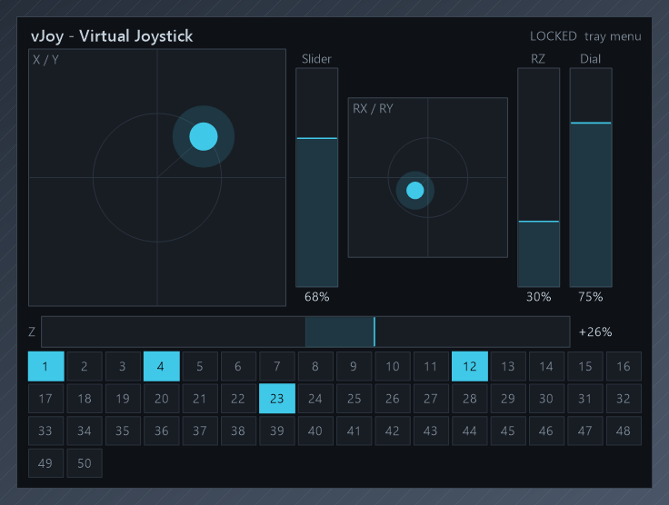
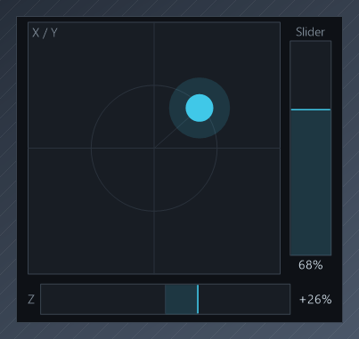
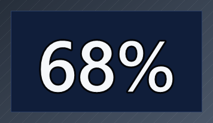
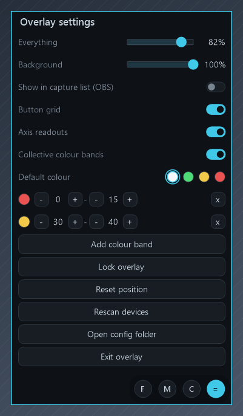
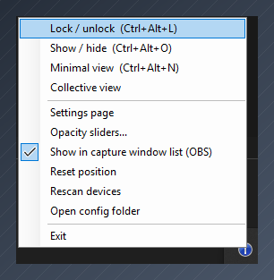

# Joystick Input Overlay

A transparent, always-on-top overlay that shows live stick, axis, hat and button input from
**any HID joystick** while you play. It reads the device's own HID report descriptor, so the
gauges it draws are whatever that device actually reports - no per-device configuration, and
no code changes to support a new stick.

| Full | Minimal | Collective |
| :---: | :---: | :---: |
|  |  |  |
| Every input the device reports | A crop of Full, trimmed to what you want mid-flight | One axis as a large number |

| Settings page | Tray menu |
| :---: | :---: |
|  |  |
| Opacity, colour bands and the rest, without leaving the game | The same options from the notification area |

Built and tested against a WINWING Ursa Minor and a vJoy virtual stick; the screenshots above
are a vJoy device, which is why the button count is 50 rather than the Ursa Minor's 128.

## Download

Grab **JoystickInputOverlay.exe** from the
[latest release](https://github.com/mcrdotnetcore/Joystick-Input-Overlay/releases/latest)
and run it. One file, nothing to install - the .NET runtime is bundled inside it.

Windows will show **"Windows protected your PC"** the first time, because the file is not code
signed. Click **More info**, then **Run anyway**. That warning is about the absence of a paid
signing certificate, not about anything the program does.

## Design goals

**Lowest possible cost while gaming.** Input arrives as `WM_INPUT` messages, so the process
sleeps completely when the stick is still — there is no polling loop. The repaint timer stops
itself after about half a second of no movement and restarts on the next report. Painting is
plain GDI+ into a small window, capped at 60 FPS and only when a value actually changed.

**Nothing that resembles cheating.** The program:

- reads input through Raw Input, registering **only** the Generic Desktop joystick, gamepad and
  multi-axis usages — keyboard and mouse are never registered, so it cannot observe typing or
  mouse movement even in principle;
- draws into **its own top-level window**. It does not inject a DLL, hook any API, or render
  inside the game — that is the mechanism used by ReShade, RivaTuner and the Discord/Steam
  overlays, and it is what anti-cheat objects to;
- never opens the game process, reads memory, or loads a driver;
- never synthesises input. It is strictly read-only — no `SendInput`, no virtual device.

The only global hooks in the process are two `RegisterHotKey` registrations (documented Win32,
not a keyboard hook) for the lock and hide shortcuts.

> The overlay will not appear over a game running in **exclusive fullscreen**. Use borderless
> windowed. On Windows 11 with "Optimizations for windowed games" enabled, borderless performs
> essentially the same as exclusive fullscreen.

## Build

Open `JoystickInputOverlay.sln` in Visual Studio 2022, or from a terminal:

```
Build.cmd
```

That produces `dist\JoystickInputOverlay.exe`: a 240 KB launcher that needs the .NET 8 Desktop
Runtime installed. Fine for working on the code, useless to someone who does not have the
runtime.

For something anyone can download and run:

```
Publish-Release.cmd
```

That produces a single self-contained `release\JoystickInputOverlay.exe` of about 63 MB with the
runtime bundled inside, verified to start in a folder containing nothing else. Both `dist\` and
`release\` are gitignored - build output does not belong in the repository.

### Cutting a release

1. `Publish-Release.cmd`
2. On GitHub: **Releases**, **Draft a new release**
3. **Choose a tag**, type a new one such as `v1.0.0`, and pick **Create new tag on publish**
4. Give it a title and a short list of what changed
5. Drag `release\JoystickInputOverlay.exe` into the attachments box
6. **Publish release**

The `/releases/latest` link above then resolves to it, so the download line in this README never
needs updating.

## Run

Double-click `dist\JoystickInputOverlay.exe`. It starts **locked**: click-through, always on top,
and it never steals focus from the game.

| Shortcut | Action |
| --- | --- |
| `Ctrl+Alt+L` | Lock / unlock. Unlocked = draggable and resizable, and the border turns cyan. |
| `Ctrl+Alt+O` | Show / hide the overlay. |
| `Ctrl+Alt+M` | Cycle view: Full, Minimal, Collective. **Only works while unlocked**, so it cannot fire by accident mid-flight. |
| Mouse wheel (unlocked) | Adjust overall opacity. |

## Views

There are three, cycled with the mode hotkey or picked from the dials. Views can only be
changed while unlocked.

| View | Shows |
| --- | --- |
| **Full** | Every input the device reports: gauges, the yaw bar and the button grid. |
| **Minimal** | A crop of Full, keeping only what survives `minimalHides`. |
| **Collective** | One axis as a large white number on navy, and nothing else. |

**Collective** is for reading collective at a glance without a gauge to interpret. It shows
`collectiveAxis` (default `Slider`), honours `invertAxes`, and reads as a signed value if that
axis is in `centreOrigin`. Colours come from `collectiveBackground` and `collectiveText`.

If the device does not report the configured axis, it falls back to the first throttle-like one
it does have - Slider, then Z, RZ, Dial, Wheel - so the view still reads something on a stick
that names its throttle differently.

Unlock it and a small **%** button appears in the top-right corner. It shows or hides the
percent symbol - `68%` or `68`. The value is a percentage either way.

The number is fitted to whatever box you drag, on both axes, so a very small window still gets a
large number. It is sized against the reading currently on screen rather than the widest possible
one, which is what makes a tiny window usable - the trade-off being that short readings draw
larger than long ones, so the number changes size as it crosses 10 % and 100 %.

**Minimal view** drops the title row, the button grid, the hat, the RX/RY mini-stick and the
RZ and Dial bars, leaving just the X/Y box and the Z and Slider bars. RZ and Dial are in that
list because a vJoy device declares them whether or not a remapper feeds them; a device that
does not report them is unaffected either way.

Change what it hides with `minimalHides`. The tokens are:

| Token | Hides |
| --- | --- |
| `Title` | The top row: device name and the lock/minimal hint. The gauges move up into the freed space and the window is trimmed to match. |
| `Labels` | The small captions inside each gauge (`X / Y`, `Z`, `Slider`, `HAT`) and the percentage readouts, for a text-free readout. Off by default. |
| `Buttons` | The button grid. |
| `XY`, `RXRY`, `HAT` | Those gauges. |
| An axis name | That bar, e.g. `Z` or `Slider`. |

With the title hidden the overlay no longer shows its own lock state, so check the tray menu
if you lose track of it.

It is a **crop, not a rescale**. Layout is always computed from the full-view window size, and
minimal simply trims the window to the gauges that survive — so every remaining gauge and label
keeps exactly the size and position it had in full view. Nothing shrinks to fit.

That also means the minimal size is measured, not stored: it is derived from the full-view size
every time, so minimal view cannot be drag-resized. Size the overlay how you like it in full
view and minimal follows. Only the full view writes `width` and `height` to the config.

## Dials and the settings page

Unlock the overlay and a row of round dials appears along the bottom: **F**, **M** and **C**
select the view, and **=** opens the settings page. They are only ever drawn while unlocked, and
the window grows by a dedicated strip to hold them, so they never cover a gauge. Lock it again
and both the dials and the strip disappear.

A **tiny circle in the top-left corner** hides that whole bar, in any view, and the window loses
the strip with it. The circle itself stays visible while unlocked - filled when the bar is on,
hollow when off - so it can always be brought back. It is stored as `showDials`.

The **settings page** replaces the overlay content with everything the tray menu carries, so
opacity can be changed without leaving the game:

- **Everything** and **Background** opacity sliders, dragged live
- **Show in capture list (OBS)**, **Button grid** and **Axis readouts** toggles
- **Collective colour bands** on/off, the default colour, and the band editor
- **Lock overlay**, **Reset position**, **Rescan devices**, **Open config folder**, **Exit**

The tray icon keeps all of it too, plus Show/hide and the separate Opacity sliders window.
Locking the overlay closes the settings page, since neither is reachable while locked.

### If a hotkey does nothing

Global hotkeys are first-come-first-served across the whole system: `RegisterHotKey` fails with
`ERROR_HOTKEY_ALREADY_REGISTERED` if another running program already owns the combination, and
the overlay simply never sees the keypress. **On this machine `Ctrl+Alt+M` is already taken by
another program**, so the config here uses `Ctrl+Alt+N` for minimal view instead.

The overlay checks every registration and falls back to a free combination when one is refused,
telling you via a tray balloon on startup. **The tray menu always shows the combination that is
actually live** — trust it over this table. To choose your own, edit `hotkeys` in the config:

```json
"hotkeys": {
  "toggleLock": "Ctrl+Alt+L",
  "toggleShow": "Ctrl+Alt+O",
  "toggleMinimal": "Ctrl+Alt+N"
}
```

Modifiers are `Ctrl`, `Alt`, `Shift`, `Win` and at least one is required. Key names follow
.NET `Keys` names: letters are `A`–`Z`, number-row digits are `D1`–`D9`, function keys `F1`–`F12`.

### Troubleshooting

Set the `JOYSTICK_OVERLAY_TRACE` environment variable to any value and the overlay appends window sizing
events to `%TEMP%\joystick-overlay-trace.log`. Useful if the window ever comes up the wrong size.

## Moving and resizing

While unlocked: drag anywhere to move, drag within 7 px of any edge or corner to resize. Then
press `Ctrl+Alt+L` to lock it back down before you fly. All three views resize, but they do it
differently because their sizes mean different things:

| View | Resizing it |
| --- | --- |
| **Full** | Sets the basis directly. |
| **Minimal** | It is a crop of Full, so a drag back-solves a basis that measures near the size you dragged, then snaps to the exact crop that basis produces. Expect a few pixels of snap, and note that Full grows with it. |
| **Collective** | Keeps whatever size you drag, in `collectiveWidth` / `collectiveHeight`, and the number scales to fill it. No snapping. Reset position clears it back to automatic. |

The settings page is a fixed layout and is drag-to-move only.

A tray icon gives you Lock/unlock, Show/hide, Minimal view, Opacity sliders, Reset position,
Rescan devices, Open config folder and Exit. Position, size, opacity and lock state are saved
automatically.

## Opacity

Tray icon then **Opacity sliders** gives two independent controls that apply live as you drag:

| Slider | Range | Effect |
| --- | --- | --- |
| **Everything** | 15 - 100 % | Fades the whole overlay uniformly, gauges included. |
| **Background only** | 0 - 100 % | Fades just the dark panel fills. Outlines, grid lines, text and every live value stay solid. |

Set the background low and you get a readable wireframe floating over the game: the crosshair,
bar outlines, fill level, dot and numbers all survive at 0 %.

This needs per-pixel transparency, which a plain window cannot do, so the overlay is a layered
window presented with `UpdateLayeredWindow`. It draws into a single reused DIB section, so a
frame is one draw pass and one blit with no per-frame allocation.

One consequence: Windows hit-tests a layered window by pixel alpha, so a fully transparent
background would leave nothing to grab. While unlocked the background alpha is therefore floored
at about 12 % so the overlay stays draggable. Lock it and your real setting applies.

## Capturing it in OBS

By default the overlay is a **tool window**, which keeps it out of alt-tab — but OBS filters
tool windows out of its Window Capture picker, so it will not be listed.

Turn on **tray icon then "Show in capture window list (OBS)"** (or `showInWindowList: true` in
the config). It applies immediately, no restart. The window is owned by a hidden parent either
way, so it still never appears on the taskbar or in alt-tab.

Then in OBS:

1. Sources, **+**, **Window Capture**. Not Game Capture - that is for Direct3D games.
2. Window: `[JoystickInputOverlay.exe]: Joystick Input Overlay`
3. **Capture Method: "Windows 10 (1903 and up)"**. This matters - the older BitBlt method
   cannot capture a layered window and gives you a black rectangle.
4. Window Match Priority: **"Match title, otherwise find window of same executable"**. This one
   matters more than it looks: the window class is a WinForms name ending in a per-build hash,
   like `WindowsForms10.Window.8.app.0.25bb5ff_r3_ad1`, and that hash changes when the app is
   rebuilt. Matching on class would break after every build; matching on the executable will not.
5. Uncheck Capture Cursor.

Because that capture method reads the window directly, the overlay does not have to be visible
on your gaming monitor. Park it in a corner or on a second screen and position it wherever you
like in the OBS scene.

### Transparency in the capture

Set the **Everything** opacity slider to 100 % for capture and control the level in OBS instead,
otherwise the overlay opacity and the OBS source opacity multiply together.

For a background-free look, either:

- set **Background only** to 0 %, then right-click the source, **Blending Mode**, **Screen**.
  The captured background is black and Screen drops black out, which suits bright cyan-on-dark
  content; or
- leave the background at 100 % and add a **Color Key** filter keyed to the background
  `#0E1116`, raising Similarity until the panels go too.

Which works best depends on your OBS version and how it handles alpha on layered windows, so
try Screen first - it needs no tuning.

## Remappers and virtual devices

The overlay follows **whichever device is actually sending input**. If the one it is showing
goes quiet for about three quarters of a second and a different one is being used, it switches
to that. `vendorId` / `productId` only decide the initial pick. Set `autoSelectDevice` to
`false` to pin it to that pick instead.

This matters with a remapper such as **Joystick Gremlin**, which reads the physical stick and
drives a **vJoy** virtual one. The virtual device is what the game sees, so it is usually what
you want on screen - and if **HidHide** is in the mix, the physical stick is hidden from
everything not on HidHide's whitelist, so the overlay cannot see it at all.

Two consequences worth knowing:

- A vJoy stick declares **all eight axes** (X, Y, Z, RX, RY, RZ, Slider, Dial) and a fixed
  button count regardless of what the remapper maps. Unmapped axes therefore sit motionless.
  Drop them with `hideAxes`, e.g. `"hideAxes": ["RZ", "Dial"]`.
- The device name in the title row tells you which one is on screen. The tray tooltip shows it
  too, which is handy in the views that hide the title.

To see the physical stick instead, add `JoystickInputOverlay.exe` to HidHide's whitelist in its
Configuration Client.

## Mapping your controls

```
Run-Diag.cmd
```

This lists the device capabilities and then logs every change as you move things:

```
  BUTTON  27  down
  BUTTON  27  up
  AXIS   Slider  62.4%   raw 2556
  HAT    NE
```

Work through the grip and base, note the numbers, then label them in the config file.

## Configuration

`%APPDATA%\JoystickInputOverlay\config.json`

| Key | Meaning |
| --- | --- |
| `x`, `y`, `width`, `height` | Window rectangle. Managed for you while you drag. |
| `opacity` | Overall, 0.15 - 1.0. Scales every pixel. |
| `backgroundOpacity` | Panel fills only, 0.0 - 1.0. Outlines, text and live values stay solid. |
| `locked` | Start locked (click-through). |
| `autoSelectDevice` | Follow whichever device is sending input. `true` by default. |
| `vendorId` / `productId` | Device preferred at startup. `0` means "whichever is found first". |
| `hideAxes` | Gauges never drawn, in any view. Same tokens as `minimalHides`. |
| `buttonCount` | Buttons drawn in the grid. `0` auto-sizes to the 128 the stick declares — set it to `32` or so if you only use the first block and want bigger cells. |
| `showButtons` | Hide the button grid entirely for a compact axes-only readout. |
| `showAxisReadouts` | Percentage text under each bar. |
| `maxFps` | Repaint ceiling, 15 – 144. Lower it if you want it even cheaper. |
| `buttonLabels` | Friendly names, e.g. `{ "1": "Trigger", "5": "Pickle" }`. |
| `gaugeOrder` | Left-to-right gauge order. Default `["XY","Z","Slider","RXRY","HAT"]`. |
| `invertAxes` | Axes drawn upside down. Defaults to `["Slider"]`. |
| `bottomBars` | Axes drawn as a full-width horizontal bar under the row. Defaults to `["Z"]`. |
| `centreOrigin` | Bars filling outward from centre, with a signed readout. Defaults to `["Z"]`. |
| `minimalHides` | What minimal view hides. Defaults to `["Buttons","HAT","RXRY","Title","RZ","Dial"]`. |
| `hotkeys` | See "If a hotkey does nothing" above. |
| `mode` | Start-up view: `Full`, `Minimal` or `Collective`. Supersedes `minimal`. |
| `minimal` | Legacy start-in-minimal flag, still honoured when `mode` is absent. |
| `showDials` | Whether the F / M / C bar is drawn while unlocked. The top-left circle toggles it. |
| `collectiveAxis` | Axis shown in Collective view. Defaults to `Slider`. |
| `collectiveShowPercent` | `true` draws the % symbol, `false` leaves the bare number. The corner button toggles it. |
| `collectiveText` | Colour when no band matches, and whenever banding is off. `White`, `Green`, `Yellow`, `Red`, or a hex value. |
| `collectiveBandsEnabled` | Whether value-based colouring is applied at all. |
| `collectiveBands` | The ranges, e.g. `[{ "min": 0, "max": 15, "colour": "Red" }]`. |
| `collectiveWidth` / `collectiveHeight` | Collective view size once dragged. `0` derives it from the basis. |
| `collectiveBackground` | Collective background colour. Defaults to `#101E3A`. |
| `collectiveText` | Collective number colour. Defaults to `#FFFFFF`. |
| `showInWindowList` | Drop the tool-window style so OBS lists it. See "Capturing it in OBS". |

Restart the overlay after editing the file.

## Layout

Reading left to right: the X/Y stick box, a vertical bar for Slider, the RX/RY mini-stick,
then the hat rosette. Underneath the row is a full-width horizontal bar for Z (yaw), and the
button grid sits below that. Anything the device does not report is simply left out, so this
works unchanged if you plug in a different stick.

**All three views are built from the device, not the config.** Full draws everything it finds,
Minimal is a crop of that same discovered list, and Collective falls back to an axis the device
actually has. Plugging in a different stick needs no config change in any view.

**Full view is built from the device, not the config.** Every Generic Desktop axis, the hat
and the button grid are drawn from what the device actually declares, so plugging in a different
stick shows all of its inputs with no config change. Vendor-specific axes are decoded but not
drawn - they have no defined meaning, so a gauge for them would be a guess.

`gaugeOrder` only decides the order of the gauges it names; anything else the device reports is
appended after them. Tokens are `XY`, `RXRY`, `HAT`, and any axis name (`X`, `Y`, `Z`, `RX`,
`RY`, `RZ`, `Slider`, `Dial`, `Wheel`). Empty the list entirely and you still get everything,
just in the default order. An axis that normally pairs into a stick box gets its own bar if the
device reports only one half of the pair.

### Horizontal and centre-origin bars

`bottomBars` lists axes pulled out of the row and drawn as a full-width horizontal bar beneath
it, spanning exactly the width the row occupies. `centreOrigin` lists bars that fill outward
from their centre rather than from the bottom or left edge, so only the direction the axis has
actually moved is shaded. Both default to `["Z"]`, which is the twist rudder on this stick.

A centre-origin bar also reads as a signed deviation - `0%` centred, `+56%` right, `-56%` left -
because "50%" for a centred yaw axis tells you nothing. Both settings work on vertical bars too,
so `"centreOrigin": ["Z", "RZ"]` is fine if another axis self-centres.

## Colouring the collective by value

Switch on **Collective colour bands** in the settings page and the collective reading takes a
colour that depends on its value. Four colours are available: **White**, **Green**, **Yellow**
and **Red**.

A band is a percentage range and a colour. Anything not covered by a band uses the **default
colour**. So with `0-15` Red and `30-40` Yellow and a White default, 16-29 and 41-100 come out
white, exactly as you would expect. Ranges are inclusive at both ends, and if two bands overlap
the one listed first wins.

The band editor gives each band a colour swatch that cycles White, Green, Yellow, Red, a stepper
for each end of the range (5 % a click, clamped to 0-100, and the ends cannot cross), and a
remove button. **Add colour band** appears until there are six. The rows are only shown when
banding is on, so the page stays short when it is off.

**The colour appears in every view**, not just Collective:

| View | What is coloured |
| --- | --- |
| **Collective** | The number. |
| **Full** and **Minimal** | The bar for `collectiveAxis` - its fill and its level line. Other gauges keep the normal cyan. |

With banding off, nothing changes colour: the number uses `collectiveText` and the bars stay
cyan. The banding is driven by the plain 0-100 % reading, so it is meant for a normal axis like
the slider rather than a centre-origin one.

The Collective number is drawn with a thin dark outline so it stays readable against a bright
cockpit or over a translucent background.

### Inverted axes

`invertAxes` flips a gauge without touching the input itself — the overlay still reports what
the hardware sends, it just draws it the other way up so it matches an axis you have inverted
in game. The Slider ships inverted for exactly that reason: physically up reads as 0 % from
the hardware, and the overlay shows it as full.

## Source map

| File | Role |
| --- | --- |
| `Native.cs` | Win32 P/Invoke — window styles, Raw Input, hotkeys. |
| `Hid.cs` | `HIDP_*` structures and `hid.dll` imports. |
| `JoystickDevice.cs` | Device enumeration, capability parsing, report decoding. |
| `RawInputManager.cs` | Raw Input registration and `WM_INPUT` dispatch. |
| `OverlayForm.cs` | The window: click-through, hit-testing, hotkeys, tray, frame timing. |
| `OverlayRenderer.cs` | All drawing. |
| `OverlayRenderer.Modes.cs` | Collective view, the dials and the settings page. |
| `ViewMode.cs` | The three views and the clickable-region types. |
| `ColourBand.cs` | The colour bands and the four named colours. |
| `LayeredSurface.cs` | The premultiplied ARGB DIB surface behind `UpdateLayeredWindow`. |
| `SettingsForm.cs` | The opacity sliders. |
| `OverlayConfig.cs` | JSON settings. |
| `Hotkey.cs` | Parses "Ctrl+Alt+M" into modifiers and a virtual key. |
| `DiagRunner.cs` | `--diag` console mode. |
